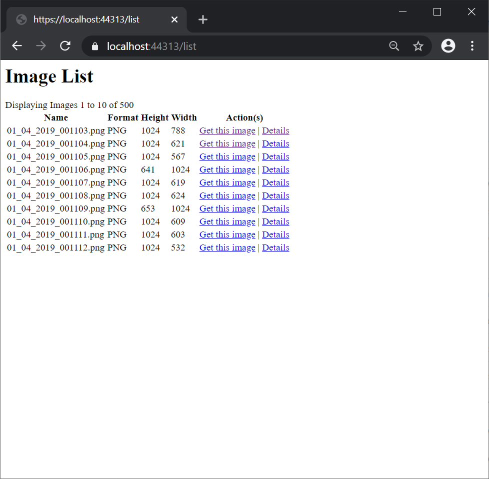

# Coding Challenge

## Some design and implementation choices

I have listed these choices to show that I have thought about the requirements and tried to balance that with making a working 'coding challenge' sized solution that doesn't make to many uninformed assumptions. 
For example I recognise that a database of image file details would be an obvious choice and its essential schema items would be straightforward.

1. I have chosen not to use a database for simplicity. A real world application may want to use a database to manage image file details, usage statistics, file locations, cached previosuly converted files etc. 
	Equally the cost and complexity of using a database may not always be necessary and an in-memory list may suffice with even greater than 40,000 images. EXIF data could be used in place of database fields for image details and search keywords.

2. I have chosen to create the main implementation as a webservice, the goal did not specify anything beyond a GET but nowadays with services supporting web applications, mobile and desktop applications a webservice seemed appropriate.
	Having chosen to implement as a webservice a simple supporting web page is easy to code.

3. I have chosen to implement a webservice method for providing a paginated image list, something such as this that returned thumbnail images would probably be a requirement for real world but for me it just made things easier to see filenames and image sizes.

4. The code to locate, list, read, convert and manipulate the images is contained in a service project CodingChallenge.Service in addition to providing the 'service' to the webswervce this can be used by a web page. 
	If any database support was required this would be added to the CodeChallenge.Service and the caller(s) such as the webservice would be unaware of the underlying implementation. 
	The image filename has been used as 'kind of' product id but I supect that you have something database driven that associates many images with your products and that the actual product id is at a higher level than the image.

5. I have chosen to use SkiaSharp because I am familiar with it having used it recently with Xamarin mobile applications, there are many image manipulation libraries available and some could be better than SkiaSharp. 
	One of it's advantages is that it has cross platform support allowing this .Net Core app to run on Linux servers, Docker containers etc.

6. I have chosen not to implement error logging, usually it is mapped to a Ilog interface and implemented with something like log4net or a company custom solution.

7. I have chosen not to implement any authentication and authorisation mechanisms, usually they are handled by code linked to custom attributes applied to controllers or individual controller actions.

8. For watermarks I have kept it simple but I do understand that their placement is important as is their impact on the image. If they are being used to deter copying they need to run across the product so that they cannot be easily cut out.
	At the same time they are often near transparent (water-like) so as not to harm the product's image too much. 

9. It is best practice to have separate models in the service and API/UI domains and map between them, for simplicity I have not implemented this fully, a common solution is to use AutoMapper and mapping configurations.

10. For a commercial webservice implementaion I would usually use a API versioning mechanism, this can be implemented using namespaces and API routes that include a version such as api\v1, api\v2 etc. 
	Any 'contract changes' to public APIs should be implemented as a new version to retain operation of previous versions. I have not used a version in the namespaces.

11. It is convenient to have controller action methods with very little code, usually I would have 'handler' classes that call the service, map and return the results.

12. I know I am not going to win awards for the web page design, it was added to make it easy for me to exercise the code.

## What would I do better if I had more time?

There is a balance to be struck between providing a working solution and an optimum solution, a better solution would take longer to implement but also would have more complexity, more bugs etc.

If I had more time to spend on this and had a test team to iterate with, I would improve this solution especially with regard to:

1. Adding a database. A database would provide features that are useful in a real-world application such as seaching for images by some characteristics, knowing which images relate to which products, pruning unused images by some 'last accessed' criteria etc.
	A database would also remove the need to generate special filename suffixes as the image characteristics would be in the database and the images names could be sequence numbers, guids etc.
2. Adding Async support and threads where beneficial.
3. Adding logging support.
4. Adding more dependency injection for testing, at the moment the simple tests rely on integration characteristics such as file paths and file names.
5. Adding more tests.
6. Adding more configuration or optional parameters to control image quality, image rotation, watermark colour/transparency/angle/font size, image aspect ratio, etc. 
7. Limiting image sizes, watermark text length etc.
8. Ensuring that the watermark fits within the image
9. Adding authentication and authorisation where required.
10. There is one optimisation where the requested file is exactly the same as the library file and we could just return the library file...
11. Load and stress test the application to see if there are throughput, contention and memory issues.

## Scalability

There is specific mention of scalability in the requirements and the choice to implement as a webservice is influenced by this. 
A small webservice such as has been implemented is a 'microservice' capable of being hosted on Azure or AWS in a serverless manner. 
Management systems are able to create and destroy instances of a microservice according to load. 
If there is a worldwide demand for images then copies of the image library can be deployed to CDN systems which are closer to the users.

If Azure/AWS is not the desired route then traditional load balanced hosting can be used instead.

Another possibility is to provide image library access via mobile applications where the client application can maintain a local cache and query the server to check for updated images via a HEAD request.

## Configuration

The only important configuration details are to provide a locations for:

1. The top level source image folder. In a real world system this might be a path to a CDN. File write access will be necessary if processed images are to be permanently cached.
	A real-world system may use other shorter term caching solutions to boost performance and reduce CPU time but it would depend on usage.

	The location for the top level source image folder is configured in appsettings.json as:

	>"SourceImagePath": "E:\\product_images",

2.  The top level converted image cache folder.

	The location for the top level converted image cache folder is configured in appsettings.json as:

	>"CacheImagePath": "E:\\cached_product_images",

These should be configured to suit your development system

Also the CodingChallenge.Tests have hard coded paths and sample filenames, these will need to match the above settings if the tests are to be run.

Setup & Run
===========

* git clone...
* open CodingChallenge.sln
* make configuration changes as detailed above to the src/CodingChallenge.Web/appsettings.json file
* set CodingChallenge.Web the startup project, build and run.

You should be greeted with this web page and there are two routes that can be followed the WebAPI and the Web UI using the respective *here* links

### The Web API main page
Here you can exercise the Web API to get a list of images and to get an image with the specified parameters.

 To get a list images click the 'GET' button next to /api/v1/images/list, press the 'Try it out' button and enter the skip and take pagination values, then press the 'Execute' button

You should see a list of file information as below, it might be useful to copy an image filename for the next screen

Now click on the GET button next to /api/v1/images/\{baseImageName\}/\{heightPx\}/\{widthPx\}/\{format\} and you should see the inpur parameters to for getting an image, click 'Try it out' and enter some values

Click 'Execute' and you should get this screen

Back to the Homepage to try the Web UI and click on the Web UI *here* link

You should see a list of images (I didn't code list pagination but you can enter querystring parameters like ?start=20&take=20) click the 'Get this image' link

Enter your parameters

Click 'Submit' to get the same screen with a link that will request the image file. Then just click on the 'Clock for image' link 

You should see the screen below

The get request to generate the image can be copied from the browser

